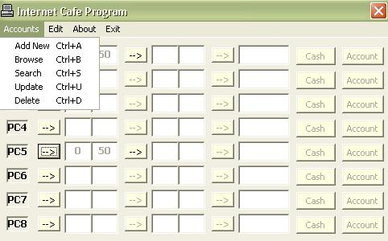



## Internet Cafe System

### Description

Internet Cafe System .. to calculate time and the cost for each PC in the cafe .. There is a DB to save user accounts and information about them
 
### More Info
 

             |
---                |---
**Submitted On**   |2002-05-28 04:08:22
**By**             |[Basheer Basata™](https://github.com/Planet-Source-Code/PSCIndex/blob/master/ByAuthor/basheer-basata.md)
**Level**          |Beginner
**User Rating**    |4.3 (13 globes from 3 users)
**Compatibility**  |VB 6\.0
**Category**       |[Databases/ Data Access/ DAO/ ADO](https://github.com/Planet-Source-Code/PSCIndex/blob/master/ByCategory/databases-data-access-dao-ado__1-6.md)
**World**          |[Visual Basic](https://github.com/Planet-Source-Code/PSCIndex/blob/master/ByWorld/visual-basic.md)
**Archive File**   |[Internet\_C1579864262003\.zip](https://github.com/Planet-Source-Code/basheer-basata-internet-cafe-system__1-45064/archive/master.zip)

